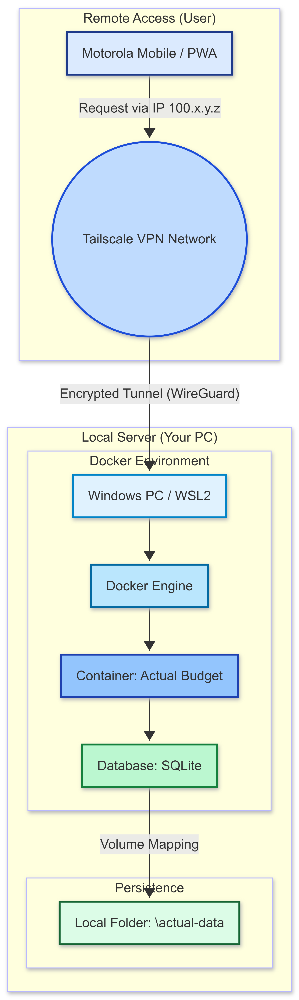
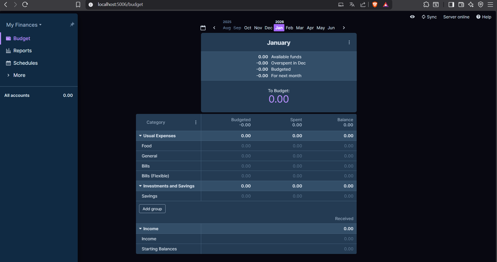
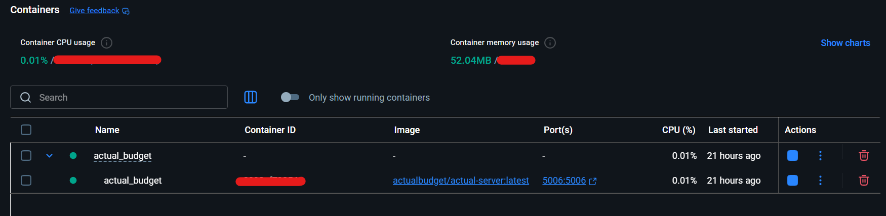
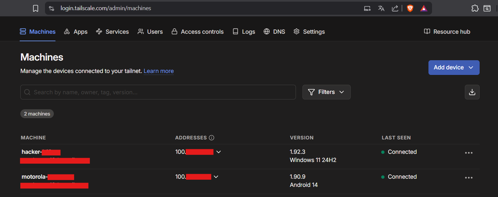
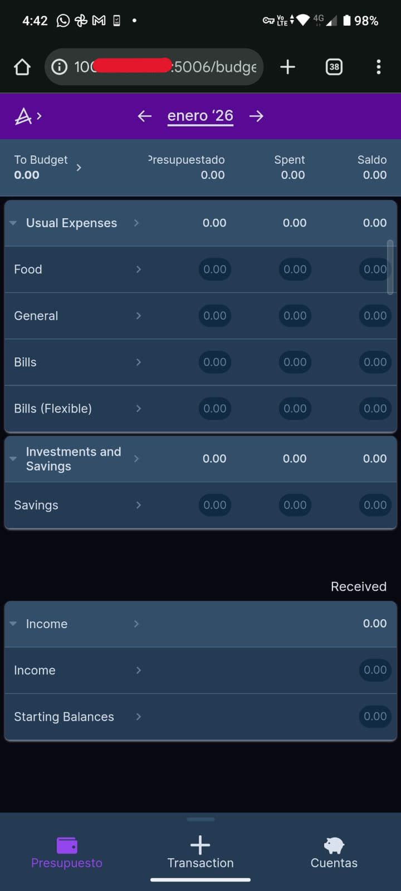

# 🚀 Actual Budget Self-Hosted Infrastructure

This project implements a private, containerized ecosystem for personal finance management. It prioritizes **data sovereignty** and **Zero-Trust networking** by combining Docker, WSL2, and a Mesh VPN.

## 🏗️ Architecture Overview
The system design focuses on secure remote access without exposing services to the public internet.



* **Core:** [Actual Budget](https://actualbudget.org/) (Open-source, local-first personal finance tool).
* **Virtualization:** Docker Containers running on **WSL2** (Linux Subsystem for Windows).
* **Network Security:** **Tailscale (WireGuard)** Mesh VPN for encrypted remote access without port forwarding.
* **Storage:** Persistent SQLite database mapping for integrity.

---

## 🔒 Security Features (Cybersecurity Focus)

* **No Port Forwarding:** By using Tailscale, the infrastructure remains invisible to the public internet, preventing ISP-level scans and brute force attacks.
* **Encrypted Tunneling:** All traffic between mobile devices and the host is encrypted via the **WireGuard** protocol.
* **Data Sovereignty:** Unlike SaaS financial apps, all sensitive data stays in local hardware (Local-first approach).
* **Container Isolation:** The application runs in a decoupled environment, reducing the host system's attack surface.

---

## 🛠️ Deployment Instructions

### 1. Prerequisites
- Docker Desktop with WSL2 backend enabled.
- A Tailscale account and client installed on both PC and Mobile.

### 2. Setup & Installation
Clone the repository and navigate to the project folder:
```bash
git clone [https://github.com/BrunoS16/actual-budget-selfhosted.git]
cd actual-budget-selfhosted
```

### 3. Run the Infrastructure
Deploy the containerized service in detached mode:
```bash
docker-compose up -d
```

### 4. Access the Service
Open your browser and navigate to your Tailscale Private IP:

```bash
 http://100.x.y.z:5006
```

### 5. Verification Commands
Check the health of the services:

* Check container status
```bash
docker ps
```
* Verify Tailscale node status
```bash
tailscale status
```
---

## 📸 Proof of Concept (Evidence)
### Financial Dashboard
The application is fully functional and accessible via the local/VPN network.



### Infrastructure Integrity
Verification of Docker containers and Tailscale mesh network connectivity.

Docker container 



Tailscale VPN



### Secure Mobile Access
Encrypted synchronization with a mobile device via the private 100.x.y.z IP.



## 🛡️ Security Roadmap (Hardening Phase)
Next steps to professionalize this infrastructure:
- [ ] **SSL/TLS Encryption:** Implementing a Reverse Proxy (Nginx/Traefik) for HTTPS.
- [ ] **Automated Backups:** Scripting encrypted off-site backups for the SQLite DB.
- [ ] **Vulnerability Scanning:** Integrating Snyk or Trivy to scan Docker images.